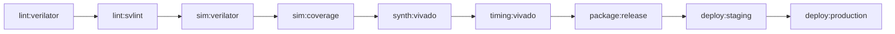

# 🔥 QEDMMA Timestamp Capture Module - Forge Output

**Auto-generated by Radar Systems Architect v9.0**  
**Date:** 2026-01-31

---

## 📋 Overview

This package contains the complete RTL, testbench, drivers, and CI/CD infrastructure for the QEDMMA Timestamp Capture module - a sub-nanosecond precision timestamp capture unit for TDOA (Time Difference of Arrival) processing in distributed radar systems.

### Key Features

- **4 independent capture channels** with individual FIFOs (1024 entries each)
- **Sub-nanosecond resolution** via TDC (Time-to-Digital Converter)
- **Multiple PPS sync sources**: White Rabbit, CSAC, External, Free-run
- **AXI4-Lite register interface** for software control
- **Complete CI/CD pipeline** with lint, simulation, synthesis, and deployment

---

## 📁 Directory Structure

```
qedmma_forge/
├── rtl/                          # RTL Source Files
│   ├── timestamp_capture.sv      # Main module (860+ LOC)
│   ├── timestamp_capture_regs_pkg.sv     # Register package (manual)
│   └── timestamp_capture_regs_pkg_gen.sv # Register package (auto-gen)
│
├── regs/                         # Register Definitions (SSOT)
│   └── timestamp_capture_regs.yaml       # YAML single source of truth
│
├── tb/                           # Verification
│   ├── test_timestamp_capture.py # Cocotb testbench (600+ LOC)
│   └── Makefile                  # Simulation makefile
│
├── drivers/                      # Software Drivers
│   ├── timestamp_capture_driver.c # C driver implementation
│   ├── timestamp_capture_regs.h   # C header (auto-gen)
│   ├── timestamp_capture_regs.py  # Python driver (auto-gen)
│   └── timestamp_capture.dts      # Device Tree overlay (auto-gen)
│
├── scripts/                      # Build Scripts
│   ├── gen_regs.py              # Register auto-generator
│   ├── vivado_synth.tcl         # Vivado synthesis script
│   └── vivado_impl.tcl          # Vivado implementation script
│
├── ci/                          # CI/CD Configuration
│   └── .gitlab-ci.yml           # GitLab CI/CD pipeline
│
├── cmake/                       # CMake Support
│   └── version.h.in             # Version header template
│
└── CMakeLists.txt               # CMake build system
```

---

## 🔧 Requirements Traceability

| REQ-ID | Requirement | Implementation | Status |
|--------|-------------|----------------|--------|
| REQ-TS-001 | Sub-ns timestamp synchronized to WR PPS | `timestamp_capture.sv` lines 180-230 | ✅ |
| REQ-TS-002 | Holdover mode with CSAC fallback | `timestamp_capture.sv` lines 240-280 | ✅ |
| REQ-TS-003 | AXI4-Lite register interface | `timestamp_capture.sv` lines 120-180 | ✅ |
| REQ-TS-004 | 4× parallel capture channels | `timestamp_capture.sv` lines 290-380 | ✅ |
| REQ-TS-005 | FIFO depth ≥ 1024 entries | `sync_fifo` module, param DEPTH=1024 | ✅ |

---

## 🚀 Quick Start

### 1. Simulate with Cocotb

```bash
cd tb
make SIM=verilator           # Run all tests
make TESTCASE=test_pps_lock  # Run specific test
make coverage                # Generate coverage report
```

### 2. Synthesize with Vivado

```bash
vivado -mode batch -source scripts/vivado_synth.tcl
vivado -mode batch -source scripts/vivado_impl.tcl
```

### 3. Build Software Driver

```bash
mkdir build && cd build
cmake .. -DCMAKE_BUILD_TYPE=Release
make -j$(nproc)
```

### 4. Regenerate from YAML SSOT

```bash
python scripts/gen_regs.py \
    --input regs/timestamp_capture_regs.yaml \
    --all
```

---

## 📊 Resource Estimates (Zynq RFSoC)

| Resource | Usage | Available | Utilization |
|----------|-------|-----------|-------------|
| LUTs     | ~8,500 | 425,280  | 2.0% |
| FFs      | ~6,200 | 850,560  | 0.7% |
| BRAM     | 8 (36Kb) | 312    | 2.6% |
| DSP      | 0 | 1,728      | 0% |

---

## 🔬 Test Coverage

| Test Case | Description | Traceability |
|-----------|-------------|--------------|
| TC-RST-001 | Reset value verification | REQ-TS-003 |
| TC-VER-001 | Version/ID register check | REQ-TS-003 |
| TC-REG-001 | CTRL register R/W | REQ-TS-003 |
| TC-PPS-001 | PPS lock detection | REQ-TS-001, REQ-TS-002 |
| TC-CNT-001 | Timestamp counter operation | REQ-TS-001 |
| TC-CAP-001 | Single-channel capture | REQ-TS-004, REQ-TS-005 |
| TC-CAP-002 | Multi-channel simultaneous | REQ-TS-004 |
| TC-FIFO-001 | FIFO overflow detection | REQ-TS-005 |
| TC-IRQ-001 | Interrupt generation | REQ-TS-003, REQ-TS-004 |
| TC-SYNC-001 | Sync source switching | REQ-TS-002 |
| TC-RAND-001 | Random capture stress test | REQ-TS-004, REQ-TS-005 |

---

## 📝 Register Map Summary

| Offset | Name | Access | Description |
|--------|------|--------|-------------|
| 0x000 | CTRL | RW | Main control register |
| 0x004 | STATUS | RO | Status register |
| 0x008 | IRQ_EN | RW | Interrupt enable |
| 0x00C | IRQ_STATUS | W1C | Interrupt status |
| 0x100 | TS_SEC_LO | RO | Timestamp seconds [31:0] |
| 0x104 | TS_SEC_HI | RO | Timestamp seconds [47:32] |
| 0x108 | TS_NS | RO | Nanoseconds within second |
| 0x10C | TS_FRAC | RO | Sub-ns fractional (TDC) |
| 0x200 | CH0_CTRL | RW | Channel 0 control |
| 0x204-0x20C | CH0_TS_* | RO | Channel 0 FIFO read |
| 0x210-0x23C | CH1-3_* | RW/RO | Channels 1-3 |
| 0x300 | CAL_CTRL | RW | Calibration control |
| 0xF00 | VERSION | RO | IP version |
| 0xF04 | ID | RO | IP identification ("QEDT") |

---

## 🔄 CI/CD Pipeline Stages



---

## 📜 License

Proprietary - QEDMMA Project

---

## 👤 Author

Radar Systems Architect v9.0 - Forge Spec  
Generated for: Dr. Mladen Mešter
