# QEDMMA System Architecture Diagrams

## 1. High-Level System Overview

## 2. Rydberg Sensor Architecture

## 3. Signal Processing Chain

```mermaid
flowchart TB
    subgraph STAGE1["STAGE 1: RF Front-End"]
        A1[Rydberg Sensor Output]
        A2[ADC 5 GSPS 14-bit]
        A1 --> A2
    end
    
    subgraph STAGE2["STAGE 2: Digital Preprocessing"]
        B1[DDC: NCO + Mixer]
        B2[FIR Low-Pass Filter<br/>127 taps]
        B3[Decimation ×20]
        B4[Circular Buffer<br/>1 GB DDR4]
        A2 --> B1 --> B2 --> B3 --> B4
    end
    
    subgraph STAGE3["STAGE 3: Correlation"]
        C1[FFT N=2M points]
        C2[Cross-Spectral<br/>X_i · X_j*]
        C3[IFFT → R_ij]
        C4[Peak Detection<br/>CFAR + Interpolation]
        B4 --> C1 --> C2 --> C3 --> C4
    end
    
    subgraph STAGE4["STAGE 4: TDOA Geolocation"]
        D1[Collect TDOAs<br/>Δt_12, Δt_13, ...]
        D2[Chan-Ho Solver<br/>Closed-Form]
        D3[Gauss-Newton<br/>Refinement]
        D4[Covariance<br/>Estimation]
        C4 --> D1 --> D2 --> D3 --> D4
    end
    
    subgraph STAGE5["STAGE 5: Tracking"]
        E1[Data Association<br/>JPDA/GNN]
        E2[IMM Filter<br/>CV/CA/CT]
        E3[Track Management<br/>Init/Update/Delete]
        E4[State Output<br/>x, v, a, P]
        D4 --> E1 --> E2 --> E3 --> E4
    end
    
    subgraph STAGE6["STAGE 6: Weapon Interface"]
        F1[Threat Assessment]
        F2[PIP Calculation]
        F3[Datalink Encoding]
        F4[UDP Transmit<br/>@ 10 Hz]
        E4 --> F1 --> F2 --> F3 --> F4
    end
```

## 4. TDOA Geometry

```mermaid
flowchart TB
    subgraph GEOMETRY["TDOA GEOLOCATION GEOMETRY"]
        TARGET["★ TARGET<br/>Unknown Position"]
        
        RX1["◆ RX1<br/>(Reference)"]
        RX2["◆ RX2"]
        RX3["◆ RX3"]
        RX4["◆ RX4"]
        
        TX["📡 TX<br/>Illuminator"]
        
        TARGET ---|"r₁"| RX1
        TARGET ---|"r₂"| RX2
        TARGET ---|"r₃"| RX3
        TARGET ---|"r₄"| RX4
        
        TX ==>|"Illumination"| TARGET
    end
    
    subgraph EQUATIONS["HYPERBOLIC EQUATIONS"]
        EQ1["TDOA₁₂ = (r₁ - r₂)/c<br/>→ Hyperbola H₁₂"]
        EQ2["TDOA₁₃ = (r₁ - r₃)/c<br/>→ Hyperbola H₁₃"]
        EQ3["TDOA₁₄ = (r₁ - r₄)/c<br/>→ Hyperbola H₁₄"]
        
        INTERSECT["H₁₂ ∩ H₁₃ ∩ H₁₄<br/>= Target Position"]
        
        EQ1 --> INTERSECT
        EQ2 --> INTERSECT
        EQ3 --> INTERSECT
    end
```

## 5. IMM Tracker Architecture

```mermaid
flowchart TB
    subgraph INPUT["MEASUREMENT INPUT"]
        Z["z_k = [x, y, z]ᵀ<br/>Position from TDOA"]
    end
    
    subgraph MIXING["MODEL MIXING"]
        MIX["Compute Mixing<br/>Probabilities μᵢⱼ"]
        MIX_STATE["Mix States:<br/>x̄ⱼ = Σ μᵢⱼ · x̂ᵢ"]
        MIX_COV["Mix Covariances:<br/>P̄ⱼ = Σ μᵢⱼ · (Pᵢ + Δxᵢ·Δxᵢᵀ)"]
        MIX --> MIX_STATE --> MIX_COV
    end
    
    subgraph FILTERS["PARALLEL FILTERS"]
        F1["EKF Model 1<br/>Constant Velocity<br/>σ_a = 1 m/s²"]
        F2["EKF Model 2<br/>Constant Acceleration<br/>σ_a = 10 m/s²"]
        F3["EKF Model 3<br/>Coordinated Turn<br/>ω = 0.05 rad/s"]
    end
    
    subgraph LIKELIHOOD["LIKELIHOOD CALCULATION"]
        L1["Λ₁ = N(ỹ₁; 0, S₁)"]
        L2["Λ₂ = N(ỹ₂; 0, S₂)"]
        L3["Λ₃ = N(ỹ₃; 0, S₃)"]
    end
    
    subgraph COMBINE["COMBINATION"]
        PROB["Update Model<br/>Probabilities:<br/>μⱼ = Λⱼ · c̄ⱼ / Σ"]
        COMB_STATE["Combined State:<br/>x̂ = Σ μⱼ · x̂ⱼ"]
        COMB_COV["Combined Covariance:<br/>P = Σ μⱼ · (Pⱼ + Δxⱼ·Δxⱼᵀ)"]
        PROB --> COMB_STATE --> COMB_COV
    end
    
    subgraph OUTPUT["TRACK OUTPUT"]
        OUT["Track State:<br/>Position, Velocity,<br/>Acceleration, Covariance"]
    end
    
    INPUT --> MIXING
    MIX_COV --> F1 & F2 & F3
    Z --> F1 & F2 & F3
    F1 --> L1
    F2 --> L2
    F3 --> L3
    L1 & L2 & L3 --> PROB
    COMB_COV --> OUTPUT
```

## 6. Weapon Guidance Interface

## 7. Deployment Configuration - Point Defense

```mermaid
flowchart TB
    subgraph COVERAGE["COVERAGE AREA<br/>150 km Radius"]
        TARGET1["✈️ Incoming Threat 1"]
        TARGET2["✈️ Incoming Threat 2"]
    end
    
    subgraph NETWORK["SENSOR NETWORK"]
        RX1["◆ RX1<br/>North"]
        RX2["◆ RX2<br/>East"]
        RX3["◆ RX3<br/>South"]
        RX4["◆ RX4<br/>West"]
        
        TX["📡 TX<br/>Illuminator"]
        C2["🖥️ C2<br/>Center"]
        
        ASSET["🏛️ Protected Asset<br/>(Airport/Base)"]
    end
    
    subgraph DEFENSE["DEFENSE ASSETS"]
        SAM1["🚀 SAM Battery 1"]
        SAM2["🚀 SAM Battery 2"]
    end
    
    TARGET1 -.->|"Detection"| RX1
    TARGET1 -.->|"Detection"| RX2
    TARGET2 -.->|"Detection"| RX3
    TARGET2 -.->|"Detection"| RX4
    
    TX ==>|"Illumination"| TARGET1
    TX ==>|"Illumination"| TARGET2
    
    RX1 & RX2 & RX3 & RX4 -->|"Data"| C2
    
    C2 -->|"Track"| SAM1
    C2 -->|"Track"| SAM2
    
    SAM1 -.->|"Engage"| TARGET1
    SAM2 -.->|"Engage"| TARGET2
    
    ASSET --- C2
    ASSET --- TX
```

## 8. Timing Synchronization Architecture

```mermaid
flowchart TB
    subgraph MASTER["WHITE RABBIT MASTER (TX Node)"]
        GPS[GPS Disciplined<br/>Reference]
        OCXO[OCXO 100 MHz<br/>±1 ppb]
        WR_M[WR Switch<br/>Grand Master]
        GPS --> OCXO --> WR_M
    end
    
    subgraph FIBER["FIBER NETWORK"]
        F1[Single-Mode Fiber<br/>< 100 km]
        F2[Single-Mode Fiber]
        F3[Single-Mode Fiber]
        F4[Single-Mode Fiber]
    end
    
    subgraph RX1_TIM["RX1 TIMING"]
        WR1[WR LEN Slave]
        CSAC1[CSAC Rb MAC<br/>Holdover]
        MUX1[Timing Mux<br/>+ PPS Gen]
        WR1 --> MUX1
        CSAC1 --> MUX1
    end
    
    subgraph RX2_TIM["RX2 TIMING"]
        WR2[WR LEN Slave]
        CSAC2[CSAC Rb MAC]
        MUX2[Timing Mux]
        WR2 --> MUX2
        CSAC2 --> MUX2
    end
    
    subgraph RX3_TIM["RX3 TIMING"]
        WR3[WR LEN Slave]
        CSAC3[CSAC Rb MAC]
        MUX3[Timing Mux]
        WR3 --> MUX3
        CSAC3 --> MUX3
    end
    
    WR_M -->|"PTP + SyncE"| F1 --> WR1
    WR_M --> F2 --> WR2
    WR_M --> F3 --> WR3
    
    subgraph SPECS["SPECIFICATIONS"]
        SPEC1["WR Connected:<br/>< 1 ns sync accuracy"]
        SPEC2["CSAC Holdover:<br/>< 5 µs drift / 4 hours"]
        SPEC3["GPS Backup:<br/>< 100 ns to UTC"]
    end
```

