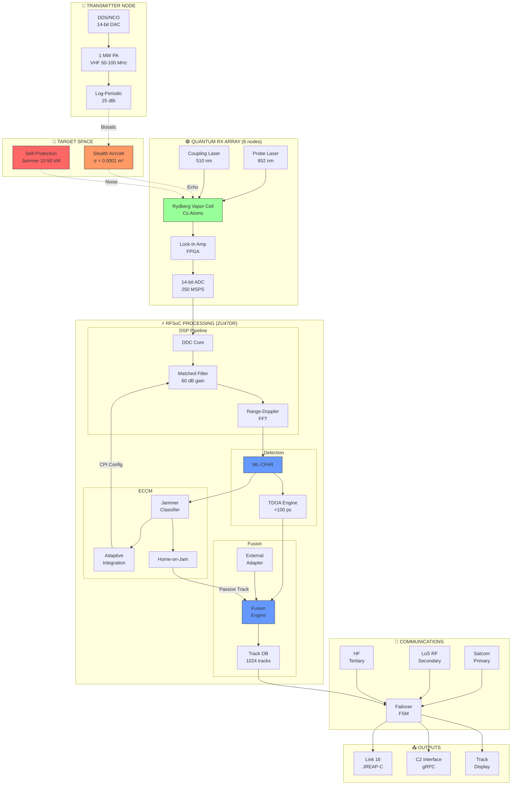
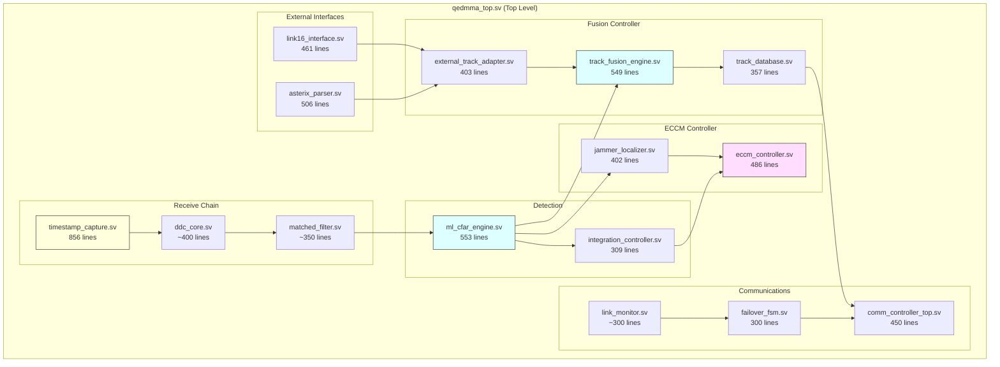
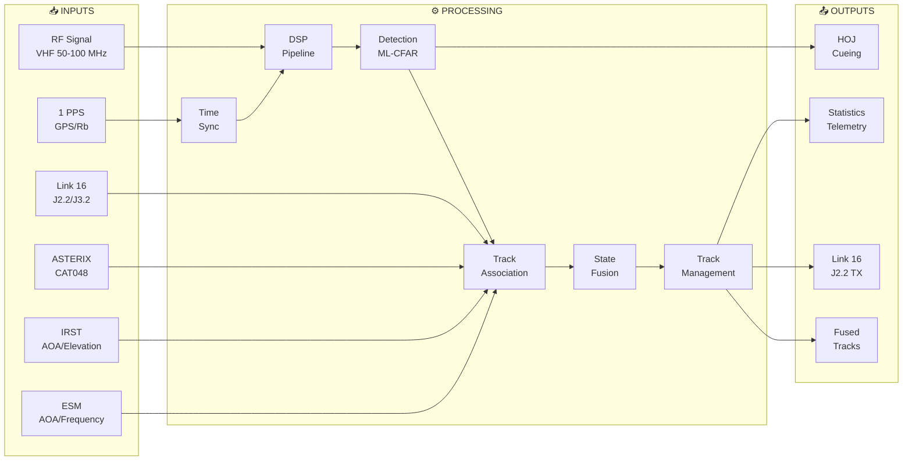
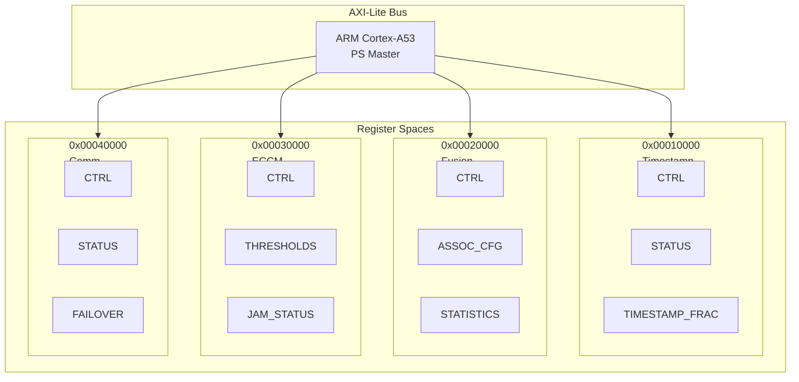
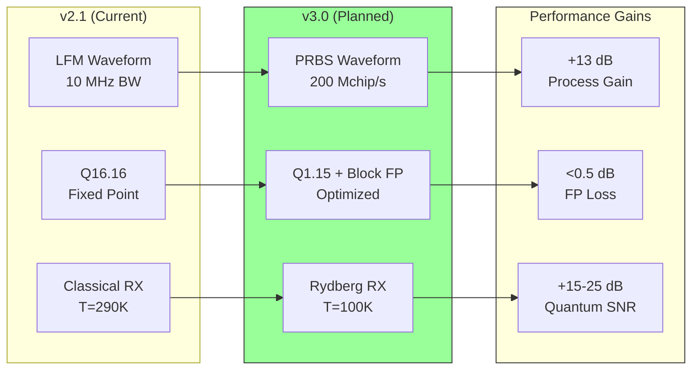
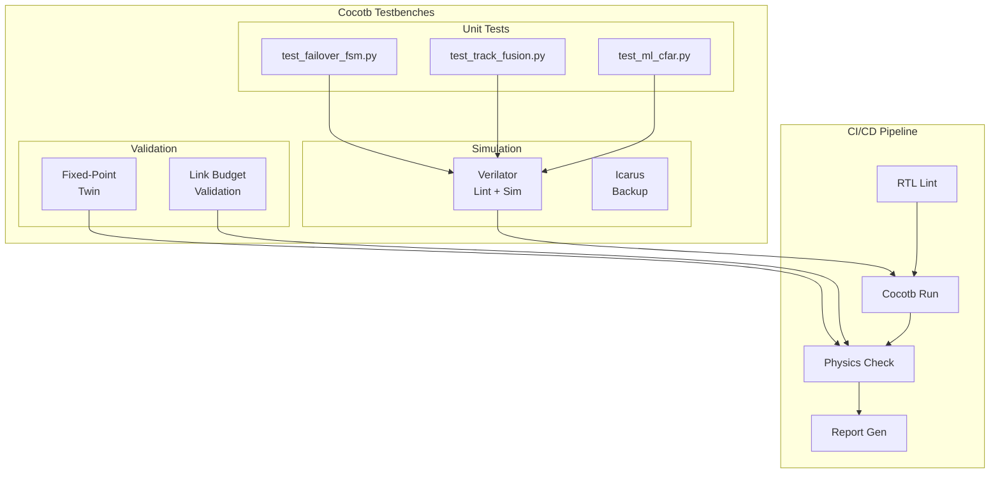

# QEDMMA System Block Diagram
## Auto-generated from Repository Structure

**Generated:** 31 January 2026  
**Version:** 2.1.0 (v3.0 Ready)

---

## 1. Top-Level System Diagram

---

## 2. RTL Module Hierarchy

---

## 3. Data Flow Diagram

---

## 4. Register Map Architecture

---

## 5. v3.0 Upgrade Path

---

## 6. Testbench Architecture

---

## Summary Statistics

| Category | Count | Lines |
|----------|-------|-------|
| RTL Modules | 14 | 5,794 |
| Register YAMLs | 4 | ~1,200 |
| Testbenches | 3 | ~900 |
| Documentation | 8 | ~2,000 |
| **Total** | **29** | **~10,000** |

---

*Auto-generated from QEDMMA-Radar-System repository structure*
